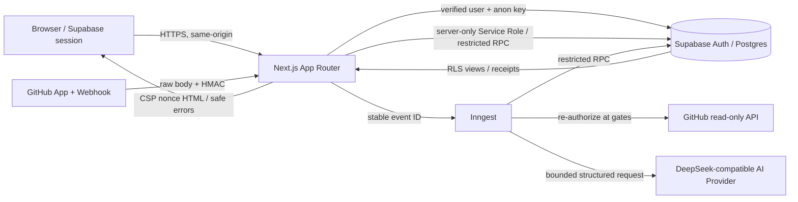

# Architecture Overview

## 1. 范围与事实源

本文描述 `Unreleased` 公开 Beta 候选的当前实现，不描述未来微服务或已完成的云端配置。事实源包括 `src/app/`、`src/domain/`、`src/application/`、`src/infrastructure/`、`src/shared/`、`supabase/migrations/`、[模块边界](module-boundaries.md) 与 [公开 Beta 威胁模型](../security/beta-threat-model.md)。

## 2. 运行时拓扑



Vercel 是计划运行时边界，但真实项目、域名、WAF、环境变量和部署证据需在 Phase 8–9 回读；当前本地证据不等同于已部署。

## 3. 代码依赖方向

依赖方向固定为 `UI / Route → application use case → domain port → infrastructure adapter`。Domain 是纯 TypeScript，不依赖 Next.js、Supabase SDK、GitHub SDK 或 Provider。Route 负责会话、请求 shape、same-origin/rate gate 与安全错误映射，不直接拼接多表事务。数据库跨表原子性由 forward-only migration 中的受限 RPC 实现。

五个面板通过 Feature Registry 和 Panel Query 公共合同保持 Preview/Connected 一致；详细规则见 [模块边界](module-boundaries.md)。

## 4. 身份、权限与信任边界

| 边界 | 身份/权限 | 允许 | 禁止/失败关闭 |
| --- | --- | --- | --- |
| Browser → Next.js | Supabase session；server 端 `getUser()` 验证 | 页面、同源 API、用户可见 receipt | 信任客户端 actor/user/project 所有权声明 |
| Next.js → Supabase | anon + verified session，或 server-only Service Role | RLS read、受限 RPC | 客户端 Service Role、direct mutation grant |
| GitHub → Webhook | raw body、`sha256=` HMAC、delivery ID | 1 MiB 内受支持 event | 先 parse 后验签、用 delivery ID 替代 HMAC |
| Worker → GitHub | Installation token、六项 read 权限 | 元数据与活动读取 | GitHub write/admin |
| Worker → AI | 固定 system contract、受限 untrusted data、schema output | 结构化 Brief/follow-up | 工具授权、Secret、原始文档正文或未验证输出持久化 |
| Database RPC | `auth.uid()` / Service Role owner check、空 `search_path` | 原子状态机、幂等、租户隔离 | PUBLIC/anon 执行敏感函数、跨租户写 |

## 5. 核心数据流

### 5.1 Onboarding 与同步

GitHub OAuth 建立登录身份；独立 GitHub App Installation 提供仓库授权。用户选择仓库并校准项目后，First Sync 先创建稳定 `sync_run`，再 dispatch Inngest。Worker 在 GitHub 读取前和持久化前重新验证账户/Installation/项目状态。Webhook 经过 HMAC 和 delivery inbox 后按稳定 event ID dispatch；Manual Resync 与每日对账复用相同同步合同。

### 5.2 Project Brief

应用层读取当前用户拥有且授权有效的项目 Evidence；数据库先原子预留 Energy，再调用 Provider。Repository-derived 文本经过大小、UTF-8/control、指令隔离处理。Provider 输出依次通过 JSON、Zod、Evidence allowlist 和原子持久化；失败路径释放预留，缓存命中不重复扣减。

### 5.3 生命周期与恢复

- Repository removal：`connected → removed` 可保留状态历史/Decision Record 并使 Evidence Link 标记 `SOURCE_REMOVED`；更强确认可继续删除整个项目子树。
- Installation revocation：可信 `installation.deleted` 使状态单向 `revoked`，取消未执行工作；已启动工作在下一授权门 No-op。
- Account deletion：`active → deletion_pending → deleting → deleted | deletion_failed`；数据库 UTC 七天窗口内可取消。业务数据与 Auth Identity 跨边界非原子，由最小 operation tombstone、lease、generation 和恢复扫描幂等收敛。

恢复操作见 [Database Restore](../runbooks/database-restore.md) 与 [Provider Outage](../runbooks/provider-outage.md)。数据分类见 [Privacy / Data Lifecycle](../privacy/data-lifecycle.md)。

## 6. 数据库与迁移

`supabase/migrations/` 当前包含按时间排序的 forward-only migration；不得修改既有 migration。public 表由 RLS、owner policy 和最小 grant 保护；敏感 `SECURITY DEFINER` 函数固定空 `search_path` 并撤销 PUBLIC/anon EXECUTE。类型由本地 schema 生成到 `src/infrastructure/database/database.types.ts`，禁止手工维护。

本地权威门禁：

```powershell
pnpm run db:reset
pnpm run db:test
pnpm run db:lint
pnpm run db:types:check
pnpm run db:drift:check
```

## 7. 幂等、并发与可观测性

Sync、Webhook、Brief、Repository removal 和 Account deletion 都绑定稳定 idempotency/request/event key。数据库通过唯一约束、行锁、版本/lease 与事务保证单赢家；Installation 与账户 lifecycle 锁必须先于 work row，避免撤权/删除之后出现新副作用。

日志只允许低基数 request/operation ID、status、reason code、timing 与不可逆 fingerprint。Provider body、Prompt、token、cookie、SQL 和 stack 不进入安全日志或公开错误。当前仓库没有已验证的生产告警/SLA；Phase 8–10 必须验证外部日志、告警和保留策略。

## 8. 部署与缓存

所有 HTML route 由根布局按请求动态渲染，以便 Next.js 从 request CSP 取得 nonce，并把同一 nonce 放入 scripts 与 response CSP。代价是失去默认静态/CDN HTML cache；静态资产仍可由平台处理。生产部署必须在 Phase 8–9 验证 CSP、cookie、callback/webhook URL、migration history、worker 签名和 Smoke Test，不能只以 build 成功替代。
